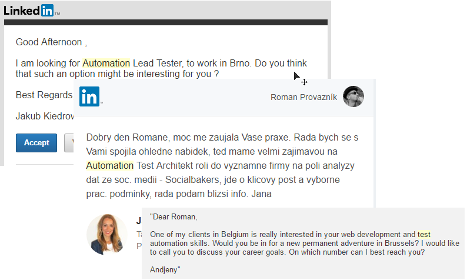
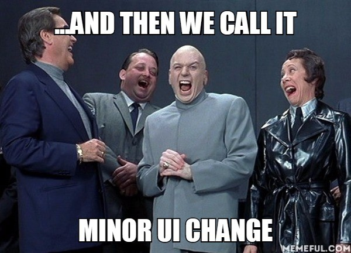
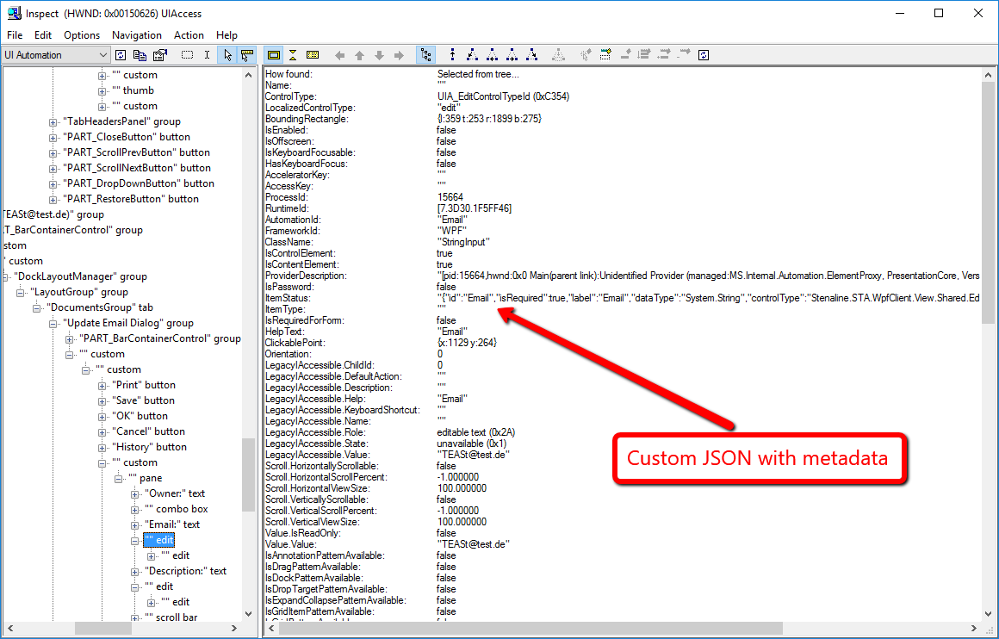
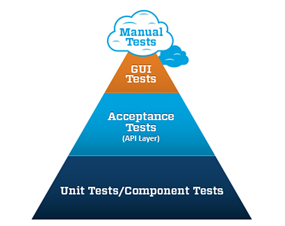
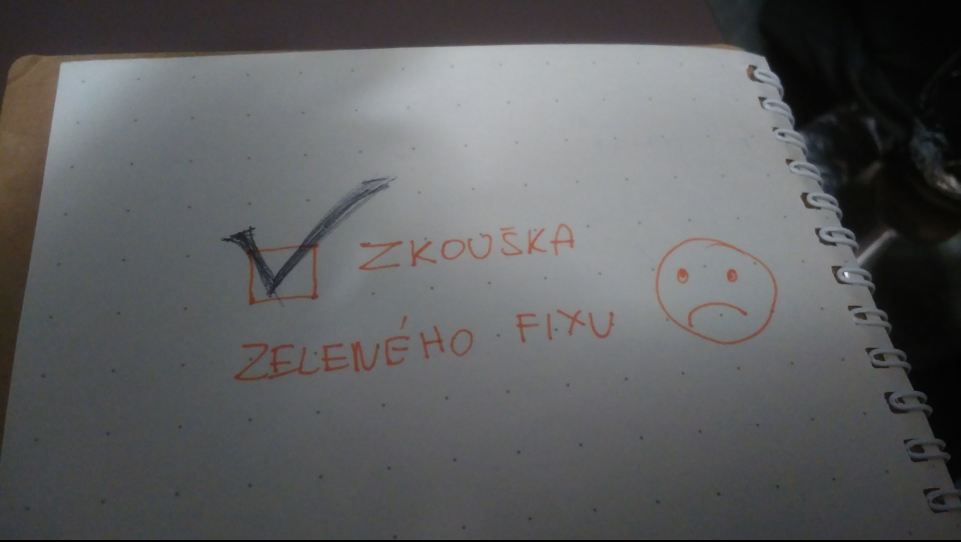

- title : UI Testing Automation
- description : UI Testing Automation Hints
- author : Roman Provazník
- theme : night
- transition : none

***************************************************************************************************

# UI Testing Automation

## Just few hints

<br/><br/><br/><br/>
### Roman Provazník

[@dzoukr](https://twitter.com/dzoukr) | [@fsharping](https://twitter.com/fsharping) | [fsharping.com](https://fsharping.com)

***************************************************************************************************


***************************************************************************************************

## UI Testing Automation

**Simulated**, **repeatable** interaction performed on **UI layer** between **virtual** user and our application

***************************************************************************************************

## **Hint #1**<br/>Please don`t do it

-----------------------------------------

## Test **code** is a **code**

#### *Thanks cpt. Obvious!*

You need to **test** it

You need to **version** it

You need to **manage** it

-----------------------------------------

## Dev in QA is **needed**



And it is **really hard** to find one

-----------------------------------------

## You are locked in **dev process**



Even **smaller** changes in UI can **affect** you

Every **great idea™** can **ruin** your work

-----------------------------------------

## It **sucks** (sometimes)

-----------------------------------------

## It **sucks** (manytimes)

-----------------------------------------

## It **sucks**

Click vs Invoke

Issues with **focus**

**Dialogs** (make`em all modal, right, right?!)

**Async** calls

**Screen** size

Page **full load** detection

... and so on

***************************************************************************************************

## OK, so **why**?!

-----------------------------------------

## Because it is f\*\*\*ing **UI**!


The most **annoying** bugs are those most **visible**

Application logic for **SPA** happens on UI layer

-----------------------------------------

## UI consolidates **complex** logic

Sometimes it is **easier** to test expected results on UI layer

One action can trigger complex processing

***************************************************************************************************

## OK, so give us some **real hints**, you moron!

-----------------------------------------

## **Hint #2**<br/>Please don`t do it<br/>(at **early** stages of your project)

-----------------------------------------


Wait for UI design is **stabilized**

-----------------------------------------

## **Hint #3**<br/>**Think** about it from the very beginning

<br/>

**Cooperate** with developers

Let them **prepare** UI layer for easier automation

-----------------------------------------

Automation **metadata** in application



-----------------------------------------

Automation **metadata** in application

```
{ 
  "id": "Id",
  "isRequired": true,
  "label": "User password",
  "dataType": "System.String",
  "controlType": "CheckBoxControl"
}

```

-----------------------------------------

Automation **metadata** in application

```

<div class="paper-button" data-reactid="42">
	<a
    	href="/candidate/sign-up"
        data-reactid="43"
        data-automation-id="sign-up"
    	>Get Offers</a>
</div>
```

This can be also **automated** (on build)

-----------------------------------------

## **Hint #4**<br/>Make your API **simple**

<br/>

Most of tests are written by **QA guys**

Don`t **bother** them with technical details

API should be based on **manual steps**

-----------------------------------------

## **Simple** API

```
let test1 = "My amazing test for deleting" &&& (fun _ ->
    Navigation.LeftMenu.click ["Application"; "General"; "Error Texts"]
    Grid.search "Code (Dec)" "123456"
    Grid.selectRow 0
    Navigation.RightMenu.click "Remove"
    Grid.search "Code (Dec)" "123456"
    Grid.rowsCount() |> Assert.areEqual 0 
)
```

-----------------------------------------

## **Simple** API

```
api.WriteTo("Login", "roman");
api.WriteTo("Password", "admin123");
api.ClickOn("Login");
```

after some time

```
qaLibrary.Login("roman", "admin123");
```

Let **QA** guys create their own libraries

-----------------------------------------

## **Simple** API

```
qaLib.Login(admin);
qaLib.DisableAccount(guest);
```

or

```
qaLib.AddToBasket(items);
qaLib.ProccedToCheckout();
```

Still, your **responsibility** should be on the **bottom** layer

-----------------------------------------

## There is one nice **side-effect**

**Some** of QA guys will start **programming**

-----------------------------------------

## There is one ugly **side-effect**

**Some** of QA guys will start **programming**

-----------------------------------------

## **Hint #5**<br/>Think about **Think time**

Real user is always **slower** than script

Sometimes easier to **wait** than detect page load

Too **fast** interaction can lead to strange **errors**

-----------------------------------------

## **Hint #6**<br/>Don`t test **everything**



Invest in **critical** paths only

-----------------------------------------

## **Hint #7**<br/>Use **existing** tools

<br/>

**Web**: Selenium (WebDriver), Nightmare.js, WatiJ, WatiR, ...

**Windows**: UI Automation (Win SDK)

**Android**: Espresso

**OSX / iOS**: Appium.io ???


***************************************************************************************************

## Summary

Build **simple** API<br/>on **existing** tools<br/>with **developers** involved<br/>to **effectively** test<br/>
**critical** or **complex** paths **only**.

***************************************************************************************************

# Thank you!



<br/>
### Roman Provazník

[@dzoukr](https://twitter.com/dzoukr) | [@fsharping](https://twitter.com/fsharping) | [fsharping.com](https://fsharping.com)