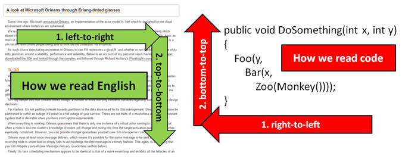

- title : The lazybones
- description : Be lazy with F#
- author : Roman Provazník
- theme : night
- transition : none

***************************************************************************************************

# The lazybones

## Be lazy with **F#**

<br/><br/><br/><br/><br/>
### Roman Provazník

[@rprovaznik](https://twitter.com/rprovaznik) | [@fsharping](https://twitter.com/fsharping) | [fsharping.com](https://fsharping.com)

***************************************************************************************************

## Ok, I am **lazy**

-----------------------------------------

## Really **lazy**

-----------------------------------------

## So I had to choose the **right language** for me

***************************************************************************************************

## F#

<table><tr><td class="table-leftcol">

**Multi**-paradigm

**Strongly** typed

**.NET** ** language

</td><td class="table-rightcol">

</td></tr></table>

-----------------------------------------

## F#

<table><tr><td class="table-leftcol">

Version 1.0 in **May 2005**

Designed by **Don Syme**

Microsoft Research

</td><td class="table-rightcol">

</td></tr></table>

-----------------------------------------

## F# is **multiparadigm**

-----------------------------------------

## OOP!


-----------------------------------------

## FP!


-----------------------------------------

## Why not both?


-----------------------------------------

## Combine OOP and FP

F# **takes the best** from both paradigms

Use **interfaces, abstract classes, inheritance**...

...as well as **high-order functions, lambdas, currying** and so on.

-----------------------------------------

## It is **.NET** language

-----------------------------------------

## Interoperability


You can **call C# code from F#** and vice versa

-----------------------------------------

## Use your favorite editor


Visual Studio, VS Code, Atom, Xamarin Studio


***************************************************************************************************

## 100% approved by **lazybones**


***************************************************************************************************

## Why do lazybones **love F#**?

***************************************************************************************************

## We don't like **specifing types**


-----------------------------------------

## We don't like **specifing types**

```
// so powerful function!
let add x y = x + y

// ok, let`s make some heavy math here
add 22 20
```

F# has **type inference**

***************************************************************************************************

## We don't like **waiting** for compilation

-----------------------------------------

## REPL

Read -> Evaluate -> Print -> Loop

1. Highlight your code
2. Press `Alt+Enter`
3. See the result
4. Maybe... convert it to unit test?

It is **much faster** to write

***************************************************************************************************

## We don't like writing **noisy code**

-----------------------------------------

## Lightweight syntax

<table><tr><td class="table-leftcol">

Based on **OCAML**

(Almost) **no** brackets

**No** semicolons

</td><td class="table-rightcol">

</td></tr></table>

***************************************************************************************************

## We don't like reading **noisy code**

-----------------------------------------

## How do we read code in C#?



<div style="font-size:20px;">
Source: <a href="http://www.slideshare.net/theburningmonk/7-ineffective-coding-habits-many-f-programmers-dont-have">http://www.slideshare.net/theburningmonk/7-ineffective-coding-habits-many-f-programmers-dont-have</a>
</div>

-----------------------------------------

## How do we read code in F#?


Using F# operators make code **much readable**

<div style="font-size:20px;">
Source: <a href="http://www.slideshare.net/theburningmonk/7-ineffective-coding-habits-many-f-programmers-dont-have">http://www.slideshare.net/theburningmonk/7-ineffective-coding-habits-many-f-programmers-dont-have</a>
</div>

***************************************************************************************************

## We don't like **checking** who is working with **our code**

-----------------------------------------

## Immutable data structures

Function types

Records

Discriminated Unions

Tuples

Lists

Option types

The Unit type

-----------------------------------------

## Why immutability?

Easy to **test**

Easy to **parallelize**

Immutability makes you code **predictable**

You know **nobody** will screw your code


***************************************************************************************************

## We don't like **writing tests**

-----------------------------------------

## State safety
(by Discriminated Union)

```
// tennis game designed on 7 rows
type Points = Zero | Fifteen | Thirty | Fourty
type Player = A | B
type Game =
    | Score of Points * Points
    | Advantage of Player
    | Victory of Player
```

Now all you need to do is to implement state transformation

-----------------------------------------

## F# makes **illegal states unrepresentable**

*which means you don't have to test it ;)

***************************************************************************************************

## We don't like **many things...**

-----------------------------------------

## ... but there is one we really **hate**

-----------------------------------------

## NULLCHECKS!

-----------------------------------------

## F# has **No NULL**

Use *Option* type instead

```
let printInt (num:int option) =
   match num with
   | Some(n) -> printf "Number was %i" n
   | None    -> printf "Sorry, no number, go home"

```

***************************************************************************************************

## Lazyboner's conclusion


-----------------------------------------

## If you want to

Write less code

Write safer code

Write less test

Forget about nullchecks

Keep your lazyboner status

***************************************************************************************************

## Choose **F#**


***************************************************************************************************

# Thank you!

## Feel free to ask

<br/><br/><br/><br/><br/>
### Roman Provazník

[@rprovaznik](https://twitter.com/rprovaznik) | [@fsharping](https://twitter.com/fsharping) | [fsharping.com](https://fsharping.com)

