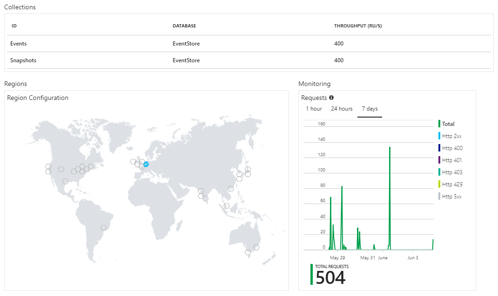
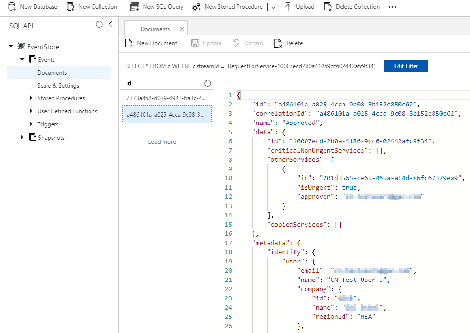
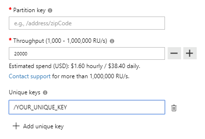

- title : Event Sourcing with F# and Azure Cosmos DB
- description : Event Sourcing with F# and Azure Cosmos DB
- author : Roman Provazník
- theme : night
- transition : none

****************************************************************************

# Event Sourcing

## with **F#** and Azure **Cosmos DB**

<br/><br/><br/><br/><br/>
### Roman Provazník

[@rprovaznik](https://twitter.com/rprovaznik) | [@fsharping](https://twitter.com/fsharping) | [fsharping.com](https://fsharping.com)

****************************************************************************

## Hello

<table><tr><td class="table-leftcol">

**CN Group** F# Lead Developer

**FSharping** founder

**Terrible** drummer


</td><td class="table-rightcol">

</td></tr></table>


****************************************************************************

## **Event Sourcing** with **F#** and Azure **Cosmos DB** 
### (why, why not and how)

****************************************************************************

## What is Event Sourcing?

----------------------------------------------------------------------------

Event sourcing persists the **state** of **domain entity** as a **sequence** of state-changing **events**.

or

Storing all the **changes (events)** to the system, rather than just its current **state**.

----------------------------------------------------------------------------

### F# TL;DR

```fsharp

type EventSourcing = State -> Event -> State

```

****************************************************************************

## Why you should **not** use Event Sourcing?

----------------------------------------------------------------------------

### Increases SW **complexity**

### Not always **fit** for your system
(mostly apps constantly resetting state)

### More difficult versioning

****************************************************************************

## Why you **should** use Event Sourcing?

----------------------------------------------------------------------------

### **Natural approach** for FP

**Immutable** (append only) storage

Each event leads to **new state**

You only need **fold** function

----------------------------------------------------------------------------

### You start **thinking different**


----------------------------------------------------------------------------

> "I want you to create application which will use React UI to make UPDATE command into table Users and set column IsActive to false."

said no customer **ever**

----------------------------------------------------------------------------

### Customers are **thinking in events**

**Deactivate** user

**Send** an email to supplier

**Publish** article

----------------------------------------------------------------------------

### Focus on **time** aspect 

**When** should this happen?

What if this happen **before** that?

----------------------------------------------------------------------------

### Focus on **behavior**

**What** instead of how

a.k.a.

**Declarative** over imperative

----------------------------------------------------------------------------

### **Thinking in events** is mindset for **all industries**

----------------------------------------------------------------------------

### Event sourcing is **easy to test**


```fsharp

[<Test>]
let ``Cannot withdraw from blocked account`` () =
    let state = { Amount = 500; IsBlocked = true }
    Withdraw 100 |> execute state |> Assert.isError
```

----------------------------------------------------------------------------

### Event sourcing is **SAFE**

----------------------------------------------------------------------------

You can **replay** all events

You can **prove system state** at any point in **history**

You have **full audit log** elevated to single source of truth

****************************************************************************

## How to start

----------------------------------------------------------------------------

### You will need **Commands**

```fsharp
type Comand = 
    | AddTask of CmdArgs.AddTask
    | RemoveTask of CmdArgs.RemoveTask
    | ClearAllTasks
    | CompleteTask of CmdArgs.CompleteTask
    | ChangeTaskDueDate of CmdArgs.ChangeTaskDueDate
```

Something you want your system to execute

----------------------------------------------------------------------------

### and some **Events**

```fsharp
type Event =
    | TaskAdded of CmdArgs.AddTask
    | TaskRemoved of CmdArgs.RemoveTask
    | AllTasksCleared
    | TaskCompleted of CmdArgs.CompleteTask
    | TaskDueDateChanged of CmdArgs.ChangeTaskDueDate
```

Things that happend based on your commands

----------------------------------------------------------------------------

### and your **Domain (State)**

```fsharp
type Task = {
    Id : int
    Name : string
    DueDate : DateTime option
    IsComplete : bool
}

type State = {
    Tasks : Task list
}
```

----------------------------------------------------------------------------

### and something called **Aggregate**

**Init** - default / empty state

**Execute** - function converting command to list of events

**Apply** - applies single event on state to create new state

----------------------------------------------------------------------------

### Init

```fsharp
type State = {
    Tasks : Task list
}
    with 
        static member Init = {
            Tasks = []
        }

```

----------------------------------------------------------------------------

### Execute

```fsharp
let execute state = function
    | AddTask args -> 
        args.Id 
        |> onlyIfTaskDoesNotAlreadyExist state 
        |> (fun _ -> TaskAdded args)
```

Can throw error or return events in Result

----------------------------------------------------------------------------

### Apply

```fsharp
let apply state = function
    | TaskAdded args -> 
        let newTask = { 
            Id = args.Id
            Name = args.Name
            DueDate = args.DueDate
            IsComplete = false
        }
        { state with Tasks = newTask :: state.Tasks}
```

Never throwns errors

----------------------------------------------------------------------------

### Aggregate

```fsharp
type Aggregate<'state, 'command, 'event> = {
    Init : 'state 
    Execute: 'state -> 'command -> 'event list
    Apply: 'state -> 'event -> 'state
}

```

****************************************************************************

## Event Store

----------------------------------------------------------------------------

**Append-only** database

Data (events) stored in **Streams**

Events stored as they appeared (**chronologically**)

----------------------------------------------------------------------------

## Event Store Solutions

<table><tr><td class="table-leftcol">

**EventStore.org** - .NET API, HTTP API, Projections

**NEventStore.org** - Persistence agnostic Event Store for .NET

Custom implementation - MongoDB, PostgreSQL, **Cosmos DB**, MSSQL


</td><td class="table-rightcol">

</td></tr></table>

****************************************************************************

## Cosmos DB

<table><tr><td class="table-leftcol">

**Globally distributed** DB on Azure

Multiple **APIs** - Document DB, Graph DB, Key-value storage

Really **fast**

**Terrible** pricing (pay for collection)

</td><td class="table-rightcol">

</td></tr></table>

----------------------------------------------------------------------------



Globally distributed

----------------------------------------------------------------------------



Built-in JSON editor

----------------------------------------------------------------------------

## Why Cosmos DB

**Azure** was a must

We did not care about pricing - need only 2 collections (Events, Snapshots)

Has support for **stored procedures**, triggers and user defined functions

Wanted to write it by ourselves - we are developers, right? :-)

----------------------------------------------------------------------------

## So we wrote own Event Store

```fsharp
type EventStore<'a> = {
    AppendToStream : string -> ExpectedPosition -> EventWrite<'a> 
        -> Result<EventRead<'a>,EventStoreError>
    GetEvent : Guid -> Result<EventRead<'a>, EventStoreError>
    GetStreamEvent : string -> int64 -> Result<EventRead<'a>, EventStoreError>
    GetStreamEvents : string -> StreamEventsRead 
        -> Result<EventRead<'a> list, EventStoreError>
    GetStreams : StreamsRead -> Result<string list, EventStoreError>
    AppendSnapshot : string -> int64 -> 'a -> Result<Snapshot<'a>, EventStoreError>
    GetSnapshot : string -> Result<Snapshot<'a> option, EventStoreError>
}
```

**Microsoft.Azure.DocumentDB** Nuget

**Only 216** LoC + 45 LoC for Stored Procedure

**Snapshots** support

----------------------------------------------------------------------------

## Lessons learned

<table><tr><td class="table-leftcol">

Use **Stored procedure** (with transaction support) to append events

Use **Unique keys** (generated from Stored procedure) for Optimistic concurrency control

</td><td width="350" class="table-rightcol">

</td></tr></table>

----------------------------------------------------------------------------

## Lessons learned

### **Use already existing solution, if you can.** 

*It is fun to write, but pain to maintain.*

****************************************************************************

## Where are we?

We have **Commands & Events**

We have **Domain**

We have **Event Store**

We have **C** from **CQRS** complete

****************************************************************************

## Now it is time to prepare **Read (query) side**

----------------------------------------------------------------------------

## Read side

Designed specially for one purpose - **provide data**

Can be **common SQL** database (with indexes, ...)

Filled based on **events**

----------------------------------------------------------------------------

## Read side

```fsharp

let handleEventToSql = function
    | TaskAdded args -> args |> makeSqlInsert
    | AllTasksCleared -> deleteAll()

```

----------------------------------------------------------------------------

## Read side - nice parts

You can **design it** based on read needs

You can **change it** anytime and replay events

You can **fill it** on different thread

Read DB failure **does not affect** your domain logic

----------------------------------------------------------------------------

## Read side can be crucial for running **validations** that **cannot be done on domain level**

(checks across various aggregation roots)

****************************************************************************

## **DEMO**

****************************************************************************

## Battlefield hints

----------------------------------------------------------------------------

## #1
## Never store **State in Read DB**

----------------------------------------------------------------------------

## #2
## **Forget** about Fire-and-Forget

At least return success of Execute function

----------------------------------------------------------------------------

## #3
## **Never** use **IFs** in Apply

That is why we return Event list

----------------------------------------------------------------------------

## #4
## **REST** is a lie

POST for commands

GET for queries

----------------------------------------------------------------------------

## #5
## **No tuples** in Commands / Events arguments

Think about serialization to Event Store

----------------------------------------------------------------------------

## #6
## **Version (upcast)** old Events in ES -> Domain mapper

```fsharp
let toEvent (j:JToken) =
    match j.["name"].Value<string>() with
    | "TaskAdded" -> j.["data"] |> upcastToV2 | TaskAdded
    | "TaskAdded_v2" -> j.["data"] |> evn<CmdArgs.AddTask> | TaskAdded

let toData = function
    | TaskAdded args -> args |> asJToken "TaskAdded"

```

****************************************************************************


****************************************************************************


# Thank you!

## Feel free to ask

<br/><br/><br/><br/><br/>
### Roman Provazník

[@rprovaznik](https://twitter.com/rprovaznik) | [@fsharping](https://twitter.com/fsharping) | [fsharping.com](https://fsharping.com)

