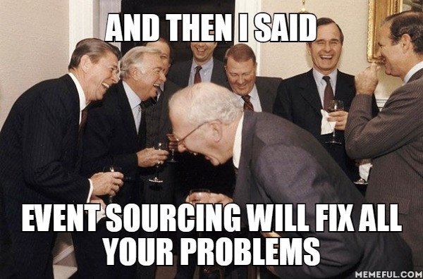
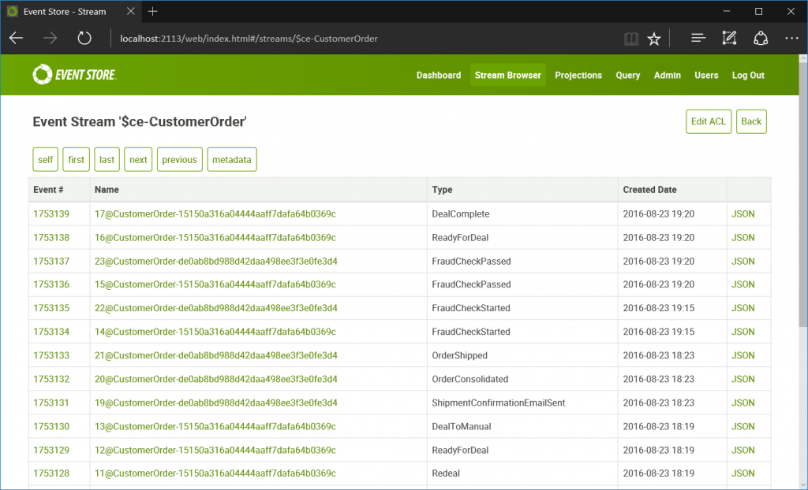
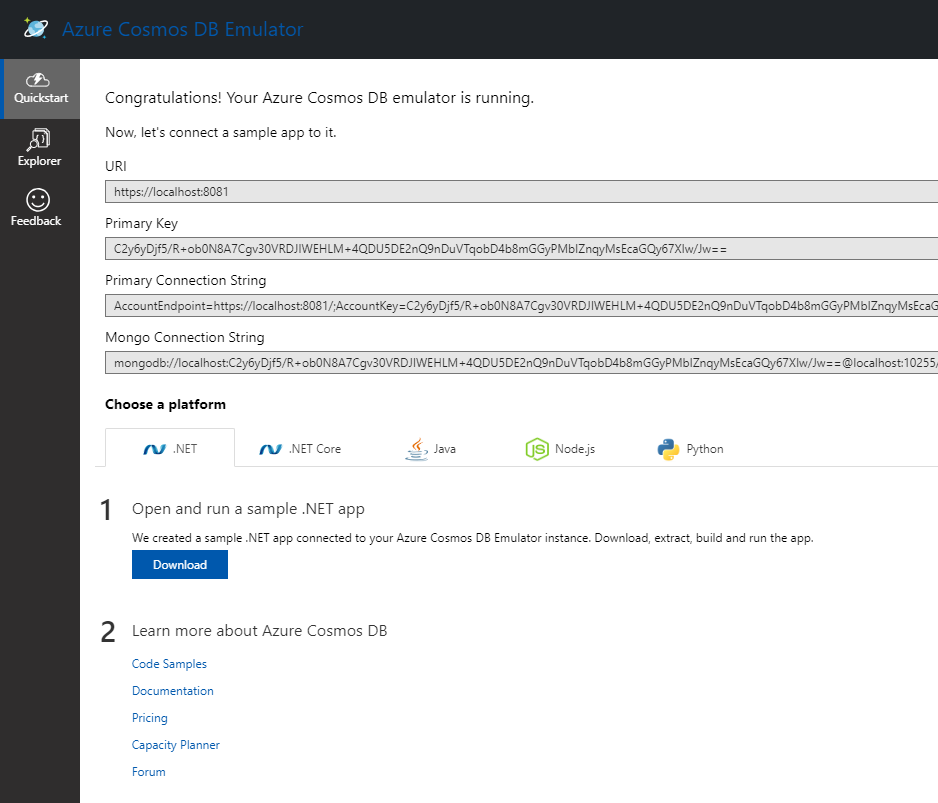

- title : Event Sourcing with F# and Azure Cosmos DB
- description : Event Sourcing with F# and Azure Cosmos DB
- author : Roman Provazník
- theme : night
- transition : none

****************************************************************************

# Event Sourcing

## with **F#** and Azure **Cosmos DB**

<br/><br/><br/><br/><br/>
### Roman Provazník

[@rprovaznik](https://twitter.com/rprovaznik) | [@fsharping](https://twitter.com/fsharping) | [fsharping.com](https://fsharping.com)

****************************************************************************

## Hello

<table><tr><td class="table-leftcol">

**CN Group** F# Lead Developer

**FSharping** founder

**Terrible** drummer


</td><td class="table-rightcol">

</td></tr></table>


****************************************************************************

## **Event Sourcing** with **F#** and Azure **Cosmos DB** 
### (why, why not and how)

****************************************************************************

## What is **Event**?

----------------------------------------------------------------------------

### Fact that **happened in past** and **cannot** be changed

----------------------------------------------------------------------------

*Things happended and we can only react on them, but cannot affect them anymore*

<br/>

Email **sent**

Article **published**

File **deleted** 

Temperature **decreased** 

Money **withdrawn**

Anniversary **forgotten**

<br/>


*Usually created based on commands or other events*

****************************************************************************

## What is **Event Sourcing**?

----------------------------------------------------------------------------

### Storing all the **changes (events)** to the system, rather than just its current **state**.

----------------------------------------------------------------------------

### F# TL;DR

```fsharp

type EventSourcing = State -> Event -> State

```

****************************************************************************

## Why you should **not** use Event Sourcing?

----------------------------------------------------------------------------

Increases SW **complexity**

Not always **fit** for your system

Has own **specific set of issues** (versioning, splitting domain, streams, ...)

----------------------------------------------------------------------------

### Event Sourcing is **not a silver bullet**

<br/>


<br/>

*sorry :-(*

****************************************************************************

## Why you **should** use Event Sourcing?

----------------------------------------------------------------------------

### **Natural approach** for FP

<br/>

Usage of append only (**immutable**) storage

Working with **immutable** structures (events)

You only need **fold** function

----------------------------------------------------------------------------

### You start **thinking different**


----------------------------------------------------------------------------

### Customers are **thinking in events**

<br/>

User to be **deactivated**

Email to be **sent** to supplier

Article to be **published**

----------------------------------------------------------------------------

### Focusing on events creates **technology agnostic communication** with customer

----------------------------------------------------------------------------

### Focus on **time** aspect 

<br/>

**When** should this event happen?

What if this event happen **before** that?

How should system react **after** some event happens?

----------------------------------------------------------------------------

### **Thinking in events** is mindset<br/> for **all industries**

----------------------------------------------------------------------------

### Event sourcing is **easy to test**


```fsharp

[<Test>]
let ``Cannot withdraw from blocked account`` () =
    let stateBeforeEvent = { Amount = 500; IsBlocked = false }
    let expectedState = { stateBeforeEvent with Amount = 400 }
    Withdrawn 100 |> apply stateBeforeEvent |> equals expectedState
```

----------------------------------------------------------------------------

### Event sourcing is **safe**

----------------------------------------------------------------------------

You can **replay** all events to create new projections

You can **prove system state** at any point in **history**

You have **full audit log** elevated to single source of truth

----------------------------------------------------------------------------

### But remember - **not a silver bullet!**



****************************************************************************

## How to start

----------------------------------------------------------------------------

### !!! Warning !!!

<br/>

Highly **opinionated** approach (one of hundreds)

Mixing **CQRS & ES** terms

----------------------------------------------------------------------------

### You will start with **Domain (State)**

```fsharp
type Task = {
    Id : int
    Name : string
    DueDate : DateTime option
    IsComplete : bool
}

type State = {
    Tasks : Task list
}
```

<br/>

*Used for validation of commands and internal state representation*

----------------------------------------------------------------------------

### with **Init (default)** value

```fsharp
type State = {
    Tasks : Task list
}
    with 
        static member Init = {
            Tasks = []
        }

```

<br/>

*State used as initial before applying events on it*

----------------------------------------------------------------------------

### then you will need **Commands**

```fsharp
type Command = 
    | AddTask of CmdArgs.AddTask
    | RemoveTask of CmdArgs.RemoveTask
    | ClearAllTasks
    | CompleteTask of CmdArgs.CompleteTask
    | ChangeTaskDueDate of CmdArgs.ChangeTaskDueDate
```

<br/>

Something you want your system to **execute**

----------------------------------------------------------------------------

### and function for such **execution**

```fsharp
let execute state command = 
    match command with
    | AddTask args -> 
        args.Id 
        |> onlyIfTaskDoesNotAlreadyExist state 
        |> (fun _ -> TaskAdded args)
```

<br/>

Can throw exception or Result

Validates command against internal state

Returns **list of Events** on success

----------------------------------------------------------------------------

### Events

```fsharp
type Event =
    | TaskAdded of CmdArgs.AddTask
    | TaskRemoved of CmdArgs.RemoveTask
    | AllTasksCleared
    | TaskCompleted of CmdArgs.CompleteTask
    | TaskDueDateChanged of CmdArgs.ChangeTaskDueDate
```

<br/>

Facts that happened **based on your commands**

Affect state (are **applied** on state)

----------------------------------------------------------------------------

### function for **applying** events on state

```fsharp
let apply state event = 
    match event with
    | TaskAdded args -> 
        let newTask = { 
            Id = args.Id
            Name = args.Name
            DueDate = args.DueDate
            IsComplete = false
        }
        { state with Tasks = newTask :: state.Tasks}
```

<br/>

Never throwns errors - only **applies** event on current state

----------------------------------------------------------------------------

### Explained as simple generic F# record

```fsharp
type Aggregate<'state, 'command, 'event> = {
    Init : 'state 
    Execute: 'state -> 'command -> 'event list
    Apply: 'state -> 'event -> 'state
}

```

****************************************************************************

## Event Store

----------------------------------------------------------------------------

**Append-only** database

Data (events) stored in **Streams**

Events stored as they appeared (**chronologically**)

----------------------------------------------------------------------------

## Streams



Correct splitting into streams is **crucial** for successful event sourcing

----------------------------------------------------------------------------

## Event Store Solutions

<table><tr><td class="table-leftcol">

**EventStore.org** - .NET API, HTTP API, Projections

**NEventStore.org** - Persistence agnostic Event Store for .NET

Custom implementation - MongoDB, PostgreSQL, **Cosmos DB**, MSSQL


</td><td class="table-rightcol">

</td></tr></table>

****************************************************************************

## Cosmos DB

<table><tr><td class="table-leftcol">

**Globally distributed** DB on Azure

Multiple **APIs** - Document DB, Graph DB, Key-value storage

Really **fast**

Various **consistency models**

**Terrible** pricing (pay for collection)

Support for **stored procedures**, **triggers** and user defined **functions**

</td><td class="table-rightcol">

</td></tr></table>

----------------------------------------------------------------------------


Globally distributed

----------------------------------------------------------------------------


Built-in JSON editor

----------------------------------------------------------------------------


Change feed for subscribing for new events

----------------------------------------------------------------------------



Free emulator available

----------------------------------------------------------------------------

## Announcing F# library for Event Store - **CosmoStore**

<table><tr><td class="table-leftcol">

Available on **Nuget** (open source on Github)

Support for **Azure Cosmos DB** and **Azure Table Storage**

Optimistic concurrency support

</td><td class="table-rightcol">

</td></tr></table>

[https://github.com/Dzoukr/CosmoStore](https://github.com/Dzoukr/CosmoStore)

****************************************************************************

## Where are we?

We have **Commands & Events**

We have **Domain**

We have **Event Store**

We have **C** from **CQRS** complete

****************************************************************************

## Now it is time to prepare **Read (Query) side**

----------------------------------------------------------------------------

## Read side

Designed specially for one purpose - **provide data**

Can be **common SQL** database (with indexes, ...)

Filled based on **events**

----------------------------------------------------------------------------

## Read side

```fsharp

let handleEventToSql event = 
    match event with
    | TaskAdded args -> args |> makeSqlInsert
    | AllTasksCleared -> deleteAll()

```

----------------------------------------------------------------------------

## Read side - nice parts

You can **design it** based on read needs

You can **change it** anytime and replay events

You can **fill it** on different thread

Read DB failure **does not affect** your domain logic

----------------------------------------------------------------------------

## Read side - ugly parts

Still  **eventually consistent**

****************************************************************************

## **DEMO**

****************************************************************************

## Battlefield hints

----------------------------------------------------------------------------

## #1
## Never store **State in Read DB**

*React on events, not on state*

----------------------------------------------------------------------------

## #2
## **Never** use **IFs** in Apply

*That is why we return Event list*

----------------------------------------------------------------------------

## #3
## **No tuples** in Commands or Events arguments

*Think about serialization to Event Store*

----------------------------------------------------------------------------

## #4
## **Think twice** before you use read side for command validation

*Think about eventual consistency*

----------------------------------------------------------------------------

## #5
## **Choose wisely** event arguments

*You will live with your decision longer than you think*

****************************************************************************


****************************************************************************

# Thank you!

## Feel free to ask

<br/><br/><br/><br/><br/>
### Roman Provazník

[@rprovaznik](https://twitter.com/rprovaznik) | [@fsharping](https://twitter.com/fsharping) | [fsharping.com](https://fsharping.com)