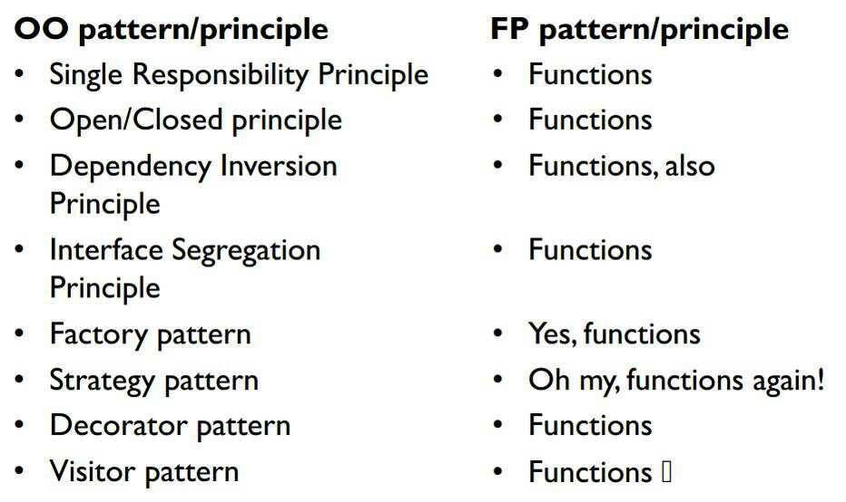

- title : F# for C# devs
- description : Introduction to F#
- author : Roman Provazník
- theme : night
- transition : none

***************************************************************************************************

# Functional .NET

## Join the **F#**orce

<br/><br/><br/><br/><br/>
### Roman Provazník

[@dzoukr](https://twitter.com/dzoukr) | [@fsharping](https://twitter.com/fsharping) | [fsharping.com](https://fsharping.com)

***************************************************************************************************

## F#

<table><tr><td class="table-leftcol">

**Multi**-paradigm

**Strongly** typed

**.NET** ** language

</td><td class="table-rightcol">

</td></tr></table>

***************************************************************************************************

## F#

<table><tr><td class="table-leftcol">

Version 1.0 in **May 2005**

Designed by **Don Syme**

Microsoft Research

</td><td class="table-rightcol">

</td></tr></table>

***************************************************************************************************

## Why join the **F#**orce?

***************************************************************************************************

## It is **.NET** language

-----------------------------------------

## Interoperability


You can **call C# code from F#** and vice versa

-----------------------------------------

## Use your favorite editor


Visual Studio, VS Code, Atom, Xamarin Studio

-----------------------------------------

## You know the platform


Use your favorite Nuget packages

Known issues/fixes

***************************************************************************************************

## F# is **multiparadigm**

-----------------------------------------

## OOP!


-----------------------------------------

## FP!


-----------------------------------------

## Why not both?


-----------------------------------------

## Combine OOP and FP

F# **takes the best** from both paradigms

Use **interfaces, abstract classes, inheritance**...

...as well as **high-order functions, lambdas, currying** and so on.

***************************************************************************************************

## **Lightweight** syntax

-----------------------------------------

## Lightweight syntax

<table><tr><td class="table-leftcol">

Based on **OCAML**

(Almost) **no** brackets

**No** semicolons

</td><td class="table-rightcol">

</td></tr></table>

-----------------------------------------

## Lightweight syntax

```

// so powerful function!
let add x y = x + y

// ok, let`s make some heavy math here
add 22 20 // return 42
```


***************************************************************************************************

## **Type** inference

-----------------------------------------

## No types specified!


```
// look ma', no types!
let multiply x y = x * y

multiply 2 21 // returns 42
```
<br/>

**Type inference** works for you

Still **strongly-typed**

Increases development **speed**

***************************************************************************************************

## **REPL** included

-----------------------------------------

Read -> Evaluate -> Print -> Loop

It is **much easier** to write

1. Highlight your code
2. Press `Alt+Enter`
3. See the result
4. Maybe... convert it to unit test?

***************************************************************************************************

## Embedded **immutability**

-----------------------------------------

## Immutable data structures

Function types

Records

Discriminated Unions

Tuples

Lists

Option types

The Unit type

-----------------------------------------

## Why immutability?

Easy to **test**

Easy to **parallelize**

Immutability makes you code **predictable**

-----------------------------------------

## Why immutability?


You **cannot screw** what you **cannot change**

***************************************************************************************************

## What we know so far?

### F# is **multiparadigm**<br/>**.NET** language, <br/>with **lightweight** syntax, <br/>**type** inference, <br/>and **immutable** data structures.

***************************************************************************************************

## But there is **much more**!

***************************************************************************************************

## Time for **deep dive**!

***************************************************************************************************

## Functions

-----------------------------------------

## Functions



**Essential** type for F#

**First-class** citizen

-----------------------------------------

## Functions

```
// simple function
let add x y = x + y
let result = add 10.0 20.0

// anonymous function
let lambdaAdd = fun a b -> a + b

// automatic generic
let printWhatever myParam = sprintf "String value is %A" myParam
```

<br/>

Still **readable**, right?

***************************************************************************************************

## Tuples

-----------------------------------------

## Tuples

Data structure with **N** elements

```
// simple tuple
let myTuple = "ahoj", 42

// destructuring
let name, value = myTuple

// ignore some values
let _, value = myTuple

// use built-in functions
let first = fst myTuple
let second = snd myTuple
```

Great for **temporary** values (no *Info classes needed)

Keep them **short**!

-----------------------------------------

## Tuples

Watch out for **comma** in functions!

```
// Two parameters
let normalAdd x y = x + y

// One!!! parameter (tuple)
let tupledAdd (x,y) = x + y
```

***************************************************************************************************

