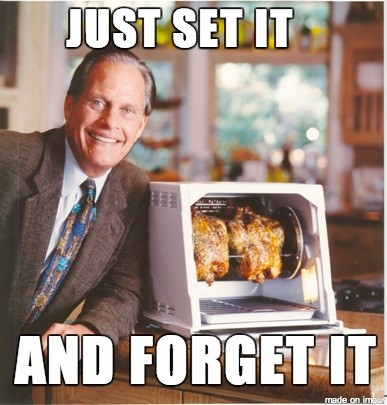
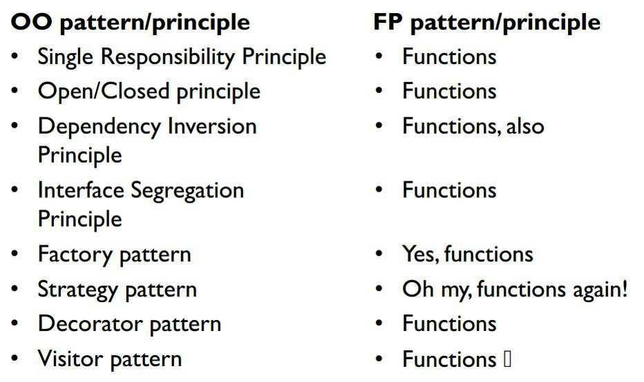
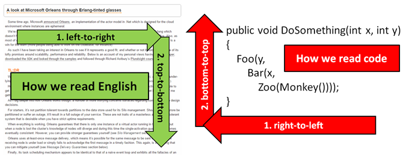
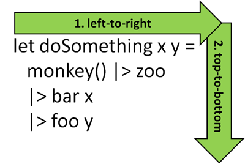

- title : Functional .NET
- description : Introduction to F#
- author : Roman Provazník
- theme : night
- transition : none

***************************************************************************************************

# Functional .NET

## Join the **F#**orce

<br/><br/><br/><br/><br/>
### Roman Provazník

[@dzoukr](https://twitter.com/dzoukr) | [@fsharping](https://twitter.com/fsharping) | [fsharping.com](https://fsharping.com)

***************************************************************************************************

## F#

<table><tr><td class="table-leftcol">

**Multi**-paradigm

**Strongly** typed

**.NET** ** language

</td><td class="table-rightcol">

</td></tr></table>

***************************************************************************************************

## F#

<table><tr><td class="table-leftcol">

Version 1.0 in **May 2005**

Designed by **Don Syme**

Microsoft Research

</td><td class="table-rightcol">

</td></tr></table>

***************************************************************************************************

## Why join the **F#**orce?

***************************************************************************************************

## It is **.NET** language

-----------------------------------------

## Interoperability


You can **call C# code from F#** and vice versa

-----------------------------------------

## Use your favorite editor


Visual Studio, VS Code, Atom, Xamarin Studio

-----------------------------------------

## You know the platform


Use your favorite Nuget packages

Known issues/fixes

***************************************************************************************************

## F# is **multiparadigm**

-----------------------------------------

## OOP!


-----------------------------------------

## FP!


-----------------------------------------

## Why not both?


-----------------------------------------

## Combine OOP and FP

F# **takes the best** from both paradigms

Use **interfaces, abstract classes, inheritance**...

...as well as **high-order functions, lambdas, currying** and so on.

***************************************************************************************************

## **Lightweight** syntax

-----------------------------------------

## Lightweight syntax

<table><tr><td class="table-leftcol">

Based on **OCAML**

(Almost) **no** brackets

**No** semicolons

</td><td class="table-rightcol">

</td></tr></table>

-----------------------------------------

## Lightweight syntax

```

// so powerful function!
let add x y = x + y

// ok, let`s make some heavy math here
add 22 20 // return 42
```


***************************************************************************************************

## **Type** inference

-----------------------------------------

## No types specified!


```
// look ma', no types!
let multiply x y = x * y

multiply 2 21 // returns 42
```
<br/>

**Type inference** works for you

Still **strongly-typed**

Increases development **speed**

***************************************************************************************************

## **REPL** included

-----------------------------------------

Read -> Evaluate -> Print -> Loop

It is **much easier** to write

1. Highlight your code
2. Press `Alt+Enter`
3. See the result
4. Maybe... convert it to unit test?

***************************************************************************************************

## Embedded **immutability**

-----------------------------------------

## Immutable data structures

Function types

Records

Discriminated Unions

Tuples

Lists

Option types

The Unit type

-----------------------------------------

## Why immutability?

Easy to **test**

Easy to **parallelize**

Immutability makes you code **predictable**

-----------------------------------------

## Why immutability?



You **cannot screw** what you **cannot change**

***************************************************************************************************

## What we know so far?

### F# is **multiparadigm**<br/>**.NET** language, <br/>with **lightweight** syntax, <br/>**type** inference, <br/>and **immutable** data structures.

***************************************************************************************************

## But there is **much more**!

***************************************************************************************************

## Time for **deep dive**!

***************************************************************************************************

## Functions

-----------------------------------------

## Functions



**Essential** type for F#

**First-class** citizen

-----------------------------------------

## Functions

```
// simple function
let add x y = x + y
let result = add 10.0 20.0

// anonymous function
let lambdaAdd = fun a b -> a + b

// automatic generic
let printWhatever myParam = sprintf "String value is %A" myParam
```

<br/>

Still **readable**, right?

***************************************************************************************************

## Tuples

-----------------------------------------

## Tuples

Data structure with **N** elements

```
// simple tuple
let myTuple = "ahoj", 42

// destructuring
let name, value = myTuple

// ignore some values
let _, value = myTuple

// use built-in functions
let first = fst myTuple
let second = snd myTuple
```

Great for **temporary** values (no *Info classes needed)

Keep them **short**!

-----------------------------------------

## Tuples

Watch out for **comma** in functions!

```
// Two parameters
let normalAdd x y = x + y

// One!!! parameter (tuple)
let tupledAdd (x,y) = x + y
```

***************************************************************************************************

## Lists

-----------------------------------------

## Lists

F# list **is not** .NET List class

**Immutable** by default

**Easy** to work with

-----------------------------------------

## Lists

```
// basics
let numbers = [0;1;2;3;4;5]
let strings = ["a";"b";"c"]
let tuples = [("ahoj",1);("nazdar",2)]

let zeroToTen = [0..10]
let zeroToHundredByTen = [0..10..100]
let down = [100..-10..0]

List.length numbers // 6 elements
List.rev numbers // reverse them

```

-----------------------------------------

## Lists

```
// join them
let czGreetings = ["Cau";"Nazdar";"Te pero"]
let enGreetings = ["Hi"; "Hello"]
let joined = czGreetings @ enGreetings // join lists

let prepended = "Pocem tak jaka?" :: czGreetings // prepend to list
```

-----------------------------------------

## Lists


```
// list comprehension
let generatedEvens = [
        for i in 1..10 do 
            if i%2=0 then yield i
    ]

let differentGen = [ for i = 0 to 10 do yield i]
```

-----------------------------------------

## Lists


```
let result = 
    [0..10..100]
    |> List.filter (fun x -> x > 50)
    |> List.map ((*) 2)
    |> List.rev
    |> List.take 3
    |> List.skip 1

// result is : int list = [180; 160] 
```

See module **Microsoft.FSharp.Collections.List**

***************************************************************************************************

## Discriminated Unions

-----------------------------------------

## Discriminated Unions

Value that can be **one** of a number of **named cases**, possibly each with **different** values and types

-----------------------------------------

## Discriminated Unions

```
type Shape =
    | Rectangle of width:float * length:float
    | Circle of radius:float

type Size = Small | Medium | Large

type Result<'a> = 
  | Success of 'a    // success with value
  | ErrorMessage of string // error message needed 

```

-----------------------------------------

## Discriminated Unions

```
// tennis game designed on 6 rows
type Points = Zero | Fifteen | Thirty | Fourty
type Player = A | B
type Game =
    | Score of Points * Points
    | Advantage of Player
    | Victory of Player
```

Using Discriminated Unions makes<br/>**illegal states unrepresentable**


***************************************************************************************************

## Option

-----------------------------------------

## Do you remember your good old friend **NULL**?


-----------------------------------------

## F# has **no NULL**

also known as *billion dollar mistake*

-----------------------------------------

## Yeap.

-----------------------------------------

## NO

-----------------------------------------

## NULL!

-----------------------------------------

## No NULL!


-----------------------------------------

## No NULL

Use **Option** type instead

```
let printInt (num:int option) =
   match num with
   | Some(n) -> printf "Number was %i" n
   | None -> printf "Sorry, no number, go home"
```

-----------------------------------------

## No NULL

```
type Option<'a> =         // use a generic definition
   | Some of 'a           // valid value
   | None                 // missing

```

Maybe you noticed: Option is built-in **discriminated union**

***************************************************************************************************

## Records

-----------------------------------------

## Records

```
type Person = {
    Name : string
    Surname : string
    Age : int
}

let person = { Name = "Roman"; Surname = "Provaznik"; Age = 34 }
let age = person.Age
let name = person.Name
```

Great for storing **contextual** values

-----------------------------------------

## Records

```
let person = { Name = "Roman"; Surname = "Provaznik"; Age = 34 }
let person2 = { Name = "Roman"; Surname = "Provaznik"; Age = 34 }

let areEqual = person = person2 // true!
```

Structural **comparison** and **equality**

-----------------------------------------

## Records

```
let person = { Name = "Roman"; Surname = "Provaznik"; Age = 34 }

person.Name <- "Mirecek" // just nope!
```

**Immutable** by default

-----------------------------------------

## Records

```
let roman = { Name = "Roman"; Surname = "Provaznik"; Age = 34 }

let jirka = { roman with Name = "Jiri"; Surname = "Krupka" }
```

But easy to **clone**

-----------------------------------------

## Records

```
type Role = 
    | CodeMonkey 
    | Manager of Employee 

and Employee = {
    Name : string
    Role : Role
    Age: int option
}

let monkey = { Name = "Roman"; Role = CodeMonkey; Age = Some(34)}
let manager = { Name = "Jaromir"; Role = Manager(monkey); Age = None}
```

Work **great** with other types (even functions!)

***************************************************************************************************

## Let`s dive even **deeper**!

***************************************************************************************************


***************************************************************************************************

## Pattern Matching

-----------------------------------------

## Pattern Matching

Patterns are **rules** for transforming input data. 

They are used to **compare** data with a **logical** structure(s), **decompose** data into constituent **parts**, or **extract** information from data in various ways.

-----------------------------------------

## WAT?


-----------------------------------------

## Pattern Matching

It is something like **switch**...

...on heavy drugs.

-----------------------------------------

## Pattern Matching

```
let tupleOne = "Roman", 34
let tupleTwo = "Pablo", 44
let tupleThree = "Roman", 36

let trollMe value = 
    match value with
    | "Roman", 34 -> printf "Is that you?"
    | "Roman", _ -> printf "Oh, different Roman"
    | _, 100 -> printf "You are old as F**K"
    | name, age -> printf "You are %s and %i years old" name age
```

-----------------------------------------

## Pattern Matching

```
let trollMeSoftly value = 
    match value with
    | _, age when age > 100 -> printf "Hey man, you are walking dead!"
    | name, _ when name = "Ivo" -> printf "Hi Ivo"
    | _ -> printf "Gotcha all!"
```

Use **when** condition for advanced filtering

-----------------------------------------

## Pattern Matching

```
type Permissions = Read | Write
type Access = Anonymous | Authorized of Permissions
type User = {
    Login : string
    Rights: Access
}

let displayLogin user =
    match user with
    | { Login = "Jakub" } -> "You are good to go, Kubo"
    | { Rights = Anonymous } -> "Anonymous access"
    | { Login = l; Rights = Authorized(perm) } -> 
        match perm with
        | Read -> sprintf "You are %s and you can read only" l
        | Write -> sprintf "You are %s and you can write" l

```

Works great with all **F# types** (Records, Discriminated Unions, ...)

-----------------------------------------

## Pattern Matching

```
let divide x y =
    try
        Some(x / y)
    with
    | :? System.DivideByZeroException as ex -> 
        printfn "Catched division by zero %s" ex.Message
        None
    | ex when ex.Message.Contains("Needle") -> None // use when
    | _ -> 
        printfn "Catched different exception"
        None

```

Try-catch is also pattern matching

-----------------------------------------

## Pattern Matching

Keeps your code **clean**

**Improves visibility** of your data flow

**Forces** you to **think** about **all possible** cases

***************************************************************************************************

## Currying

-----------------------------------------

## Currying

Named after mathematician **Haskell Brooks Curry**

Transformation of function with **N parameters**<br/> into **chain** of **N functions** with **1 parameter**

-----------------------------------------

## Currying

```
//normal version
let add x y = x + y

//explicitly curried version
let add x =                   // only one parameter!
   let subFunction y = x + y  // new function with one param
   subFunction                // return the subfunction

// lambda version
let add x = fun y -> y + x
```
-----------------------------------------

## What is it good for?

***************************************************************************************************

## Partial function application

-----------------------------------------

## Partial function application

```
// normal function
let add x y = y + x

// "bake in" value
let add10 = add 10

// pass only second parameter
let result = add10 90

```

-----------------------------------------

## Partial function application


```

// build on existing List.filter function
let filterEvens = List.filter (fun i -> i%2 = 0)

// test
let evens = filterEvens [1;2;3;4] //[2;4]
```

**Powerfull** concept

Builds on already **existing** functions

***************************************************************************************************

## Operators


-----------------------------------------

## How do we read code in C#?



<div style="font-size:20px;">
Source: <a href="http://www.slideshare.net/theburningmonk/7-ineffective-coding-habits-many-f-programmers-dont-have">http://www.slideshare.net/theburningmonk/7-ineffective-coding-habits-many-f-programmers-dont-have</a>
</div>

-----------------------------------------

## How do we read code in F#?



Using F# operators make code **much readable**

<div style="font-size:20px;">
Source: <a href="http://www.slideshare.net/theburningmonk/7-ineffective-coding-habits-many-f-programmers-dont-have">http://www.slideshare.net/theburningmonk/7-ineffective-coding-habits-many-f-programmers-dont-have</a>
</div>

-----------------------------------------

## Operators

**|>** Pipe forward

**<|** Pipe backward

**>>** Forward composition

**<<** Backward composition

But there are **much more** of them...

-----------------------------------------

## Pipe forward (|>)

```
printf "Ahoj"
"Ahoj" |> printf

[1..20] 
|> List.filter (fun x -> x > 10)
|> List.map (fun x -> x + 100)
|> List.map (fun x -> sprintf "%d is in string now" x)
|> List.rev
```

Applies value on the left side as the **last parameter**<br/>to the function on the right side

Pipe forward operator is extremely **common** in F#

-----------------------------------------

## Pipe backward (<|)

```
printf "%i" 1+2          // error
printf "%i" (1+2)        // using parens
printf "%i" <| 1+2       // using reverse pipe
```

Reduces the need for **parentheses** and makes the code **cleaner**

-----------------------------------------

## Forward composition (>>)

```
let add1 x = x + 1
let times2 x = x * 2

// compose them together
let add1Times2 = add1 >> times2
```

-----------------------------------------

## Forward composition (>>)

```
// example with parameters
let add n x = x + n
let times n x = x * n
let add1Times2 = add 1 >> times 2
let add5Times3 = add 5 >> times 3

// test
add5Times3 1 // 18
```

-----------------------------------------

## Backward composition (<<)

```
// backward composition
let add x y = x + y
let times x y = x * y
let add1Times2 = add 1 >> times 2
add1Times2 10 // 22

let times2Add1 = add 1 << times 2
times2Add1 10 // 21 -> used backward composition
```

-----------------------------------------

## Custom operators

```
// custom operators
let (===) str regex = 
	System.Text.RegularExpressions.Regex.Match(str, regex).Success

"abcd" === "bc" // infix notation (first param before operator)
"abcd" === "de"
```

-----------------------------------------

## Cool, right?


***************************************************************************************************

## What we know now?

### F# is **multiparadigm**<br/>**.NET** language, <br/>with **lightweight** syntax, <br/>**type** inference, <br/>and **immutable** data structures...

-----------------------------------------

### ...having **Pattern matching**, **currying**, **partial function** application, **operators**, no ** NULL** and much **more**!

***************************************************************************************************

# Thank you!

## Feel free to ask

<br/><br/><br/><br/><br/>
### Roman Provazník

[@dzoukr](https://twitter.com/dzoukr) | [@fsharping](https://twitter.com/fsharping) | [fsharping.com](https://fsharping.com)