- title : Sneaking F# into your organization
- description : FSharpX 2019 Lightning Talk
- author : Roman Provazník
- theme : night
- transition : none

******

# Sneaking F#  into your organization #

    <h3>Roman Provazník</h3>

[@rprovaznik](https://twitter.com/rprovaznik) | [@fsharping](https://twitter.com/fsharping) | [fsharping.com](https://fsharping.com)

*******

## About me

<table><tr><td>

</td><td>

F# lead developer in CN Group  (Prague, CZ)

FSharping meetup group founder

Ex-C# developer

</td></tr></table>

-------

## I am not that Roman

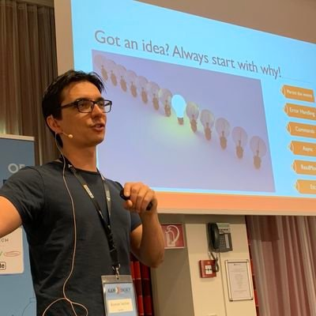

    Totally <strong>different Roman</strong>

-------

## F# in CN Group

<table><tr><td>

</td><td>

Started as **single** F# developer with **no customers**

Now with **5 full-time F# developers**

Customers from UAE, United Kingdom, Sweden, Germany, Denmark, Finland...

</td></tr></table>

-------

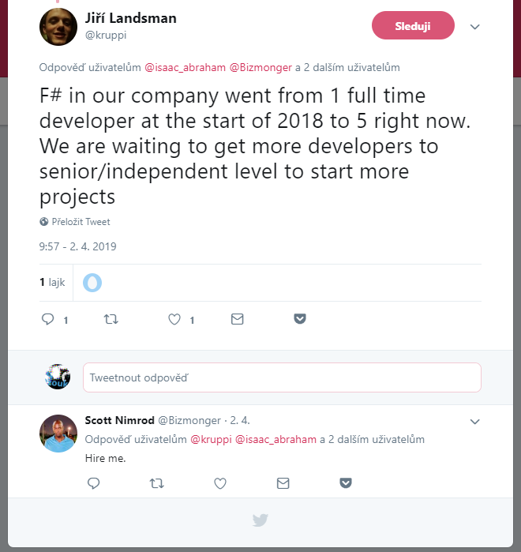

*******

# Do you really want to be  full-time F# developer?

-------

# Really?

-------

# Really, really?

-------

# Really, really, really...?

-------

# Then I got some warnings for you

*******

##  It's **not** going to happen  over night

    It took me <strong>14 months</strong> to get strategic project for F#

-------

## F# was, is, and always will be .NET language **number 2**

    Sorry...

-------

## Problem with F# is **not** really technical

-------

## It is all about marketing...

*******

# ... and you are in marketing now

<strong>Less</strong> coding

<strong>More</strong> talking

<strong>A lot</strong> of strong promises

*******
- data-background:images/noooo.gif

# SORRY

*******

## Step #1 - **Educate** colleagues

Show them F#

Use some fancy stuff like Fable

Get their attention

-------

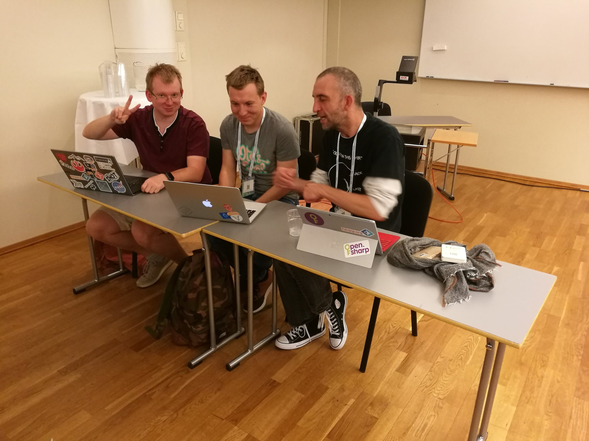

*C#er being converted to rainbow F# path of happiness*

-------

## **Never** troll them!!!

Don't be "you're doing it wrong" guy

Don't question their code, tools, metodology

Negative approach leads nowhere

You want them to be your future F#ers, not enemies!

*******

## Step #2 - **Seek** for internal opportunities

Internal projects

QA department

-------

## Internal projects

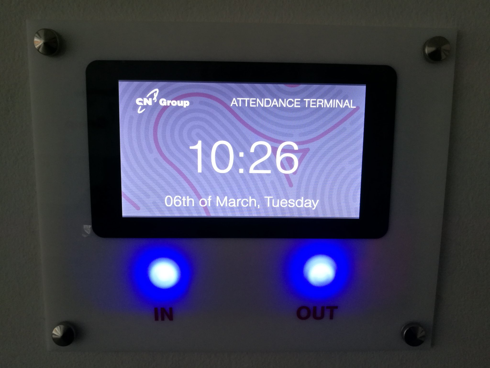

Attendance system, REST APIs, surveys, ...

-------

## QA is gold mine of opportunity!

 

Always <strong>understaffed</strong>

Always <strong>hungry</strong> for smart solutions

Always <strong>grateful</strong> for help

-------

## QA as **F# trojan horse**

<table><tr><td>

</td><td>

UI Automation (Canopy)

Data cleanup (FSharp.Data)

Infrastructure (FAKE)

</td></tr></table>

-------

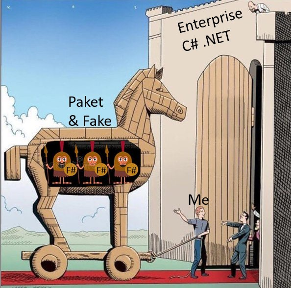

*******

## Step #3 - **Publicize** your success

Tweets

Success stories on meetups

Whatever you did is **AWESOME** - no fake modesty!

-------

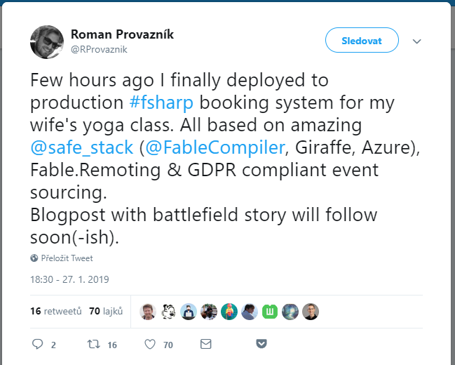

Lame app for wife? **AWESOME!**

*******

## Step #4 - **Attend** F# meetups

If it doesn't exist - establish one!

**Give talks**

Talk to attendees (they are the **influencers** in their companies)

-------

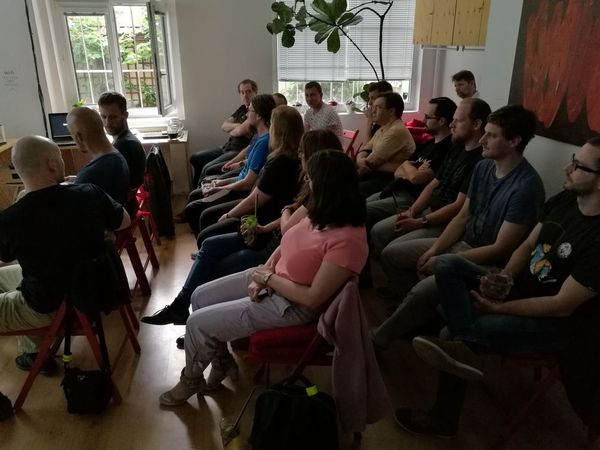

Prague FSharpers

*******

## Step #5 - **Educate** competitors

Reply to .NET job offerings

Teach them: **.NET is not only C#**

Your current competitor can be your **future employer**

-------

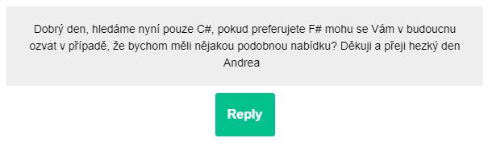

*C# only sorry*

-------

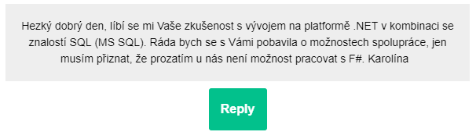

*Not now, sorry*

-------

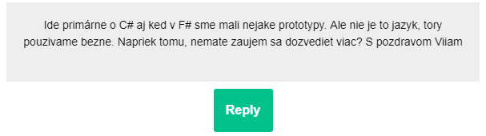

*We got some F# prototypes, but C# only for now*

*******

# Already sick of all the marketing?

*******

# Now it is time to sell it to your boss

-------

## The Boss

<table><tr><td style="min-width: 400px;">

</td><td>

Show **all** your (AWESOME) work

Use all **dirty tricks** (LoC metrics, Less bugs)

Request to be "**the F# pioneer**" of your company...

</td></tr></table>

...and be ready to **stake on** your career

*******

# Game Over, right?

-------

Nope

-------

*******

## Now even **harder** journey begins

-------

## **Educate** customers (a.k.a. sell)

Partnership conferences

Newsletters

Smalltalks in office

-------

## Educate customers

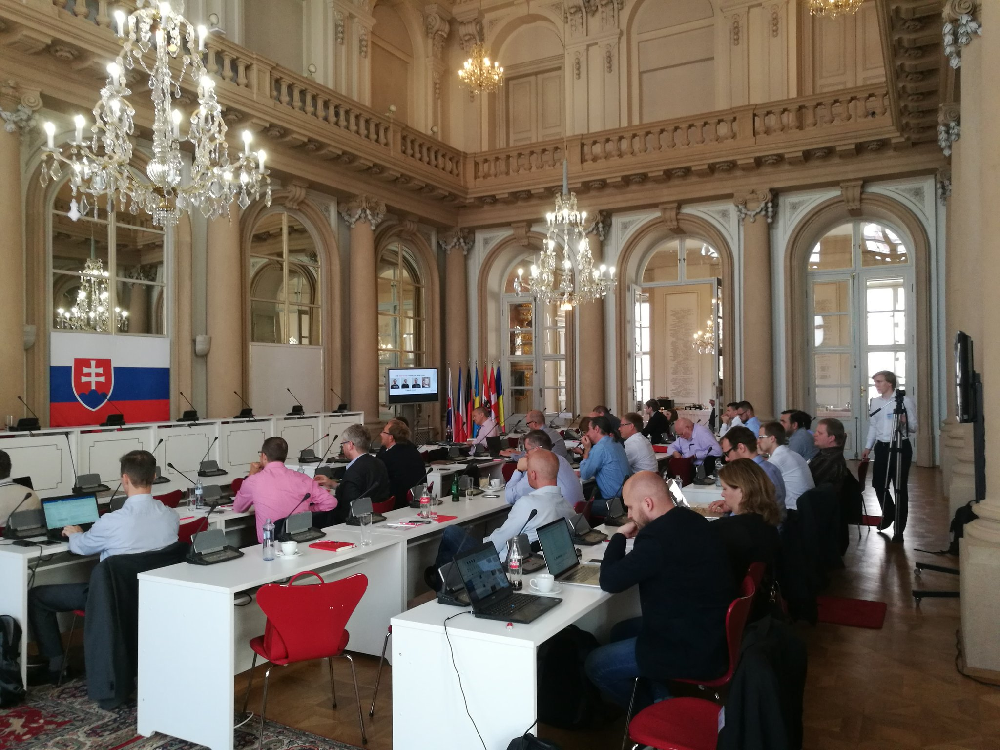

**F# at Partnership conference** in Bratislava (Slovakia)

-------

## Sales department is your new **best friend**

-------

## ...and the most important

-------

# Your first major F# project must be success

-------

# Then you WIN!

for now...

******

# Thank you

    <h3>Roman Provazník</h3>

[@rprovaznik](https://twitter.com/rprovaznik) | [@fsharping](https://twitter.com/fsharping) | [fsharping.com](https://fsharping.com)

*******

