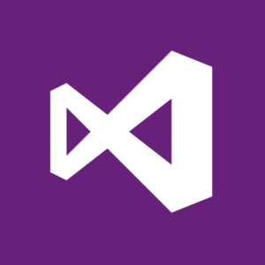
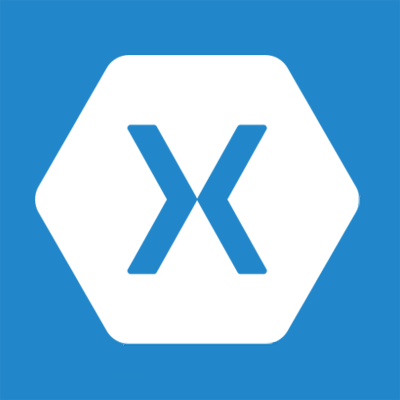
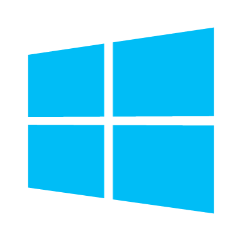

- title : What is F#?
- description : F# described in 30 minutes
- author : Roman Provazník
- theme : night
- transition : none

***************************************************************************************************

# What is F#?

TODO

***************************************************************************************************

## F#

<table><tr><td class="table-leftcol">

**Multi**-paradigm

**Strongly** type

**.NET** ** language

</td><td class="table-rightcol">

</td></tr></table>

***************************************************************************************************

## F#

<table><tr><td class="table-leftcol">

Version 1.0 in **May 2005**

Designed by **Don Syme**

Microsoft Research

</td><td class="table-rightcol">

</td></tr></table>

***************************************************************************************************

## Why should I care?

***************************************************************************************************

## #1<br/>It is .NET language

-----------------------------------------

## Interoperability


You can call C# code from F# and vice versa

-----------------------------------------

## Use your favorite editor






Visual Studio, VS Code, Atom, Xamarin Studio

-----------------------------------------

## You know the platform


Use your favorite Nuget packages

Known issues/fixes

***************************************************************************************************

## #2<br/>F# is multiplatform

-----------------------------------------

## Develop anywhere




You can be a hipster and .NET developer at the very same time!

-----------------------------------------

## Compile F# to Javascript

Compiler that emits Javascript you can be proud of

Visit <a href="http://fable.io">http://fable.io</a>

***************************************************************************************************

## #3<br/>F# is multiparadigm

-----------------------------------------

## OOP!


-----------------------------------------

## FP!


-----------------------------------------

## Why not both?


-----------------------------------------

## Combine OOP and FP

F# **takes the best** from both paradigms

Use interfaces, abstract classes, inheritance...

...as well as high-order functions, lambdas, currying and so on.

***************************************************************************************************

## #4<br/>F# is easy to write

-----------------------------------------

## Lightweight syntax

<table><tr><td class="table-leftcol">

Based on **OCAML**

(Almost) **no** brackets

**No** semicolons

</td><td class="table-rightcol">

</td></tr></table>

-----------------------------------------

## Lightweight syntax

```

// so powerful function!
let add x y = x + y

// ok, let`s make some heavy math here
add 22 20 // return 42
```

-----------------------------------------

## Did you notice?

-----------------------------------------

## No types specified!


```

// look ma', no types!
let multiply x y = x * y

multiply 2 21 // returns 42
```
<br/>

**Type inference** works for you

Still **strongly-typed**

-----------------------------------------

## REPL included

Read -> Evaluate -> Print -> Loop

It is **much easier** to write

1. Highlight your code
2. Press Alt+Enter
3. See the result
4. Maybe... convert it to unit test?

***************************************************************************************************

## #5<br/>F# is easy to read

-----------------------------------------

## How do we read code in C#?


<div style="font-size:20px;">
Source: <a href="http://www.slideshare.net/theburningmonk/7-ineffective-coding-habits-many-f-programmers-dont-have">http://www.slideshare.net/theburningmonk/7-ineffective-coding-habits-many-f-programmers-dont-have</a>
</div>

-----------------------------------------

## How do we read code in F#?


Using F# operators make code **much readable**

<div style="font-size:20px;">
Source: <a href="http://www.slideshare.net/theburningmonk/7-ineffective-coding-habits-many-f-programmers-dont-have">http://www.slideshare.net/theburningmonk/7-ineffective-coding-habits-many-f-programmers-dont-have</a>
</div>

-----------------------------------------

## F# has many useful operators

```
// pipe forward operator
let sayHello text = sprintf "Hello %s" text
"Roman" |> sayHello

// pipe backward
printf "Square of the 10 should be %i" <| square 10

// forward composition
let add10 x = x + 10
let add10AndSayHello = add10 >> string >> sayHello

```

...and many more!

***************************************************************************************************

## #6<br/>F# embraces safety

-----------------------------------------

## Immutable data structures

Function types

Records

Discriminated Unions

Tuples

Lists

Option types

The Unit type

-----------------------------------------

## Why immutability?

Easy to **test**

Easy to **parallelize**

Immutability makes you code **predictable**

-----------------------------------------

## Why immutability?


You **cannot screw** what you **cannot change**

-----------------------------------------

## State safety

<br/>

**Yaron Minsky**: Make illegal states unrepresentable

-----------------------------------------

## State safety
(by Discriminated Union)

```
// tennis game designed on 7 rows
type Points = Zero | Fifteen | Thirty | Fourty
type Player = A | B
type Game =
    | Score of Points * Points
    | Deuce of Player
    | Advantage of Player
    | Victory of Player
```

Now all you need to do is to implement state transformation

-----------------------------------------

## F# makes illegal states unrepresentable

-----------------------------------------

### and speaking about safety...

-----------------------------------------

## F# has no NULL

also known as *billion dollar mistake*

-----------------------------------------

## Yeap.

-----------------------------------------

## NO

-----------------------------------------

## NULL!

-----------------------------------------

## No NULL!


-----------------------------------------

## No NULL

Use *Option* type instead

```
let printInt (num:int option) =
   match num with
   | Some(n) -> printf "Number was %i" n
   | None    -> printf "Sorry, no number, go home"

```

***************************************************************************************************

## #7<br/>F# has amazing community

-----------------------------------------

## Plenty of libraries

[FAKE](http://fsharp.github.io/FAKE/) - F# Make (task runner)

[Paket](http://fsprojects.github.io/Paket/) - better Nuget package manager

[Ionide](http://ionide.io/) - an Atom Editor and Visual Studio Code package suite for cross platform F# development

[Suave](http://suave.io/) - web development library

[Fable](http://fable.io/) - F# to Javascript compiler

[FsProjects](http://fsprojects.github.io/) - community project incubatio space

-----------------------------------------

## Many user groups

[community.fsharp.org](http://community.fsharp.org/) - list of worldwide user groups

[FSharping](https://fsharping.com) - Czech F# community

-----------------------------------------

## Slack channels

[fsharp.slack.com](http://fsharp.slack.com/) - F# Software foundation official Slack channel

[fsharping.slack.com](http://fsharping.slack.com) - Czech F# community official Slack channel

***************************************************************************************************

## Where to start?

[FSharp.org](http://fsharp.org) - F# Software foundation

[F# for fun & profit](https://fsharpforfunandprofit.com/) - F# Bible (must read!)

[TryFSharp.org](http://tryfsharp.com/) - online learning tutorials


